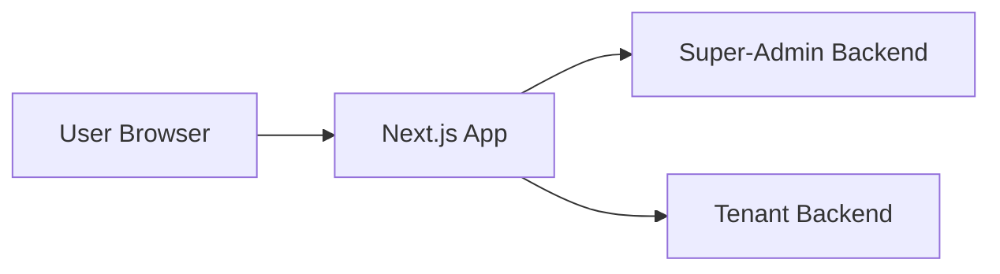
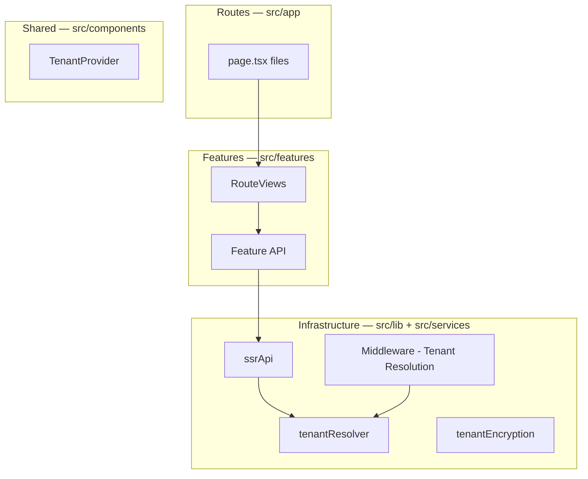

# Architecture

How the **Next.js Multitenant Template** is organized and how data flows through the system.

## System context



## Layer diagram



## Key principles

1. **Thin routes** — `src/app/**/page.tsx` sets metadata and renders a `*RouteView`.
2. **Tenant from Host only** — middleware extracts tenant from subdomain, never from body/query/client-headers.
3. **Deny by default** — no tenant → 403 QT-TEN-403.
4. **Validated config** — Zod env parsing at startup.
5. **Server-only secrets** — encryption keys and API client credentials never reach the browser.

## Layers

| Layer                     | Path                                         | Responsibility                        |
| ------------------------- | -------------------------------------------- | ------------------------------------- |
| Middleware                | `src/middleware.ts`                          | Tenant resolution from Host subdomain |
| Routes                    | `src/app/`                                   | URLs, metadata, composition           |
| Features                  | `src/features/`                              | Domain UI, validators, API            |
| Components                | `src/components/`                            | Shared UI, providers                  |
| Services                  | `src/services/api/`                          | ssrApi, tenantResolver                |
| Lib                       | `src/lib/`                                   | Encryption, env, errors, utilities    |
| Constants / Types / Hooks | `src/constants/`, `src/types/`, `src/hooks/` | Config and shared logic               |

## Tenant resolution flow

1. Request arrives at `src/middleware.ts`.
2. Middleware extracts tenant short code from Host subdomain (`{tenant}-{product}-{env}.domain`).
3. Middleware sets `x-tenant` header; calls `tenantResolver` to validate against registry.
4. No valid tenant on a tenant-scoped route → 403 QT-TEN-403.
5. Server components read tenant via `currentTenant()` from `src/lib/tenant.ts`.
6. Client components read tenant via `useTenant()` from `TenantProvider`.

## Routing

| URL         | Page                        | Description            |
| ----------- | --------------------------- | ---------------------- |
| `/examples` | `src/app/examples/page.tsx` | Tenant-scoped examples |
| `/`         | System scope (excluded)     | No tenant required     |
| `/admin`    | System scope (excluded)     | No tenant required     |

Route constants: `src/constants/routes.ts`.

## App Router (`src/app/`)

### Page pattern

Pages stay thin — metadata plus a feature `*RouteView`:

```tsx
import type { Metadata } from "next";
import { ExamplesRouteView } from "@/features/examples/ExamplesRouteView";

export const metadata: Metadata = { title: "Examples" };

export default function ExamplesPage() {
  return <ExamplesRouteView />;
}
```

### Client vs server

| Server component        | Client component (`"use client"`) |
| ----------------------- | --------------------------------- |
| Static layout, metadata | Forms, tables, event handlers     |
| Tenant resolution       | React state, Zustand              |
| ssrApi data fetching    | Programmatic navigation           |

> **Note:** This project uses Next.js 16 with breaking changes from earlier versions. See [AGENTS.md](../../AGENTS.md).

## Related

- [API](../api/README.md)
- [Standards — multitenancy](../standards/nextjs-multitenant-template.md)
