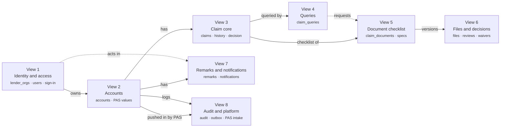
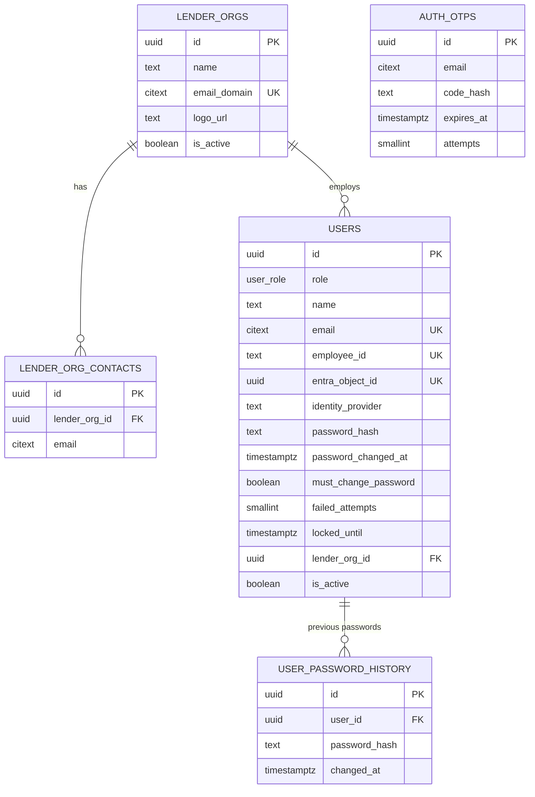
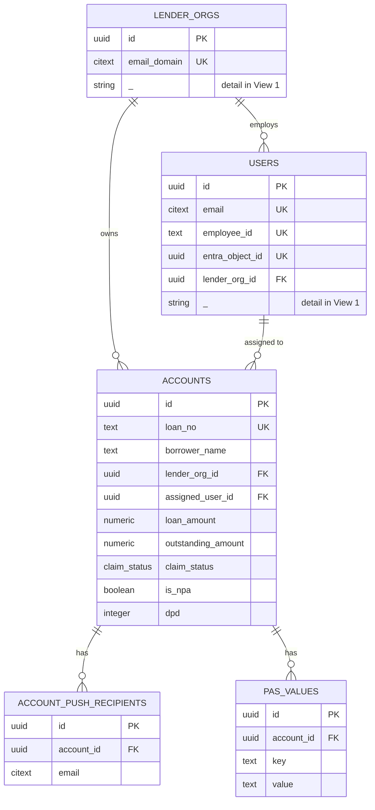
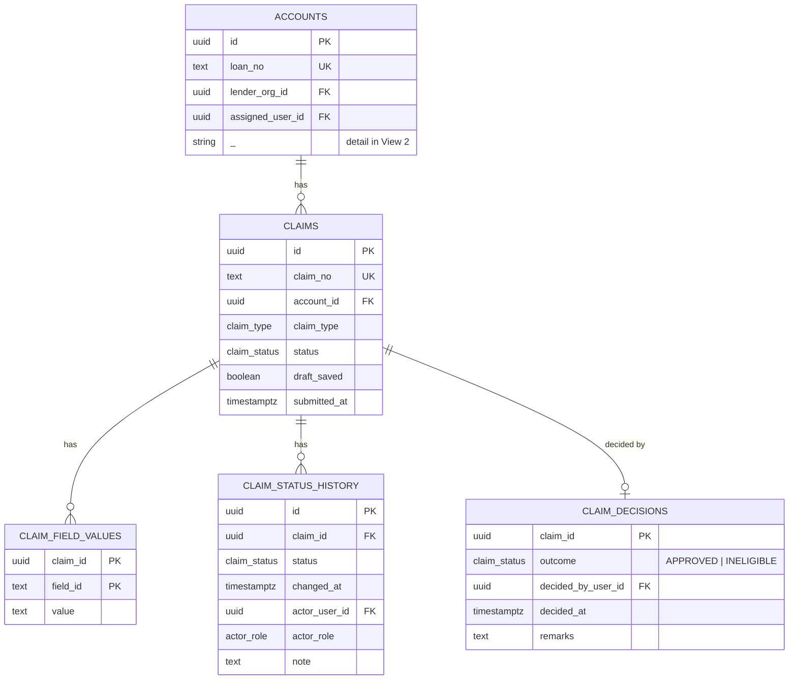
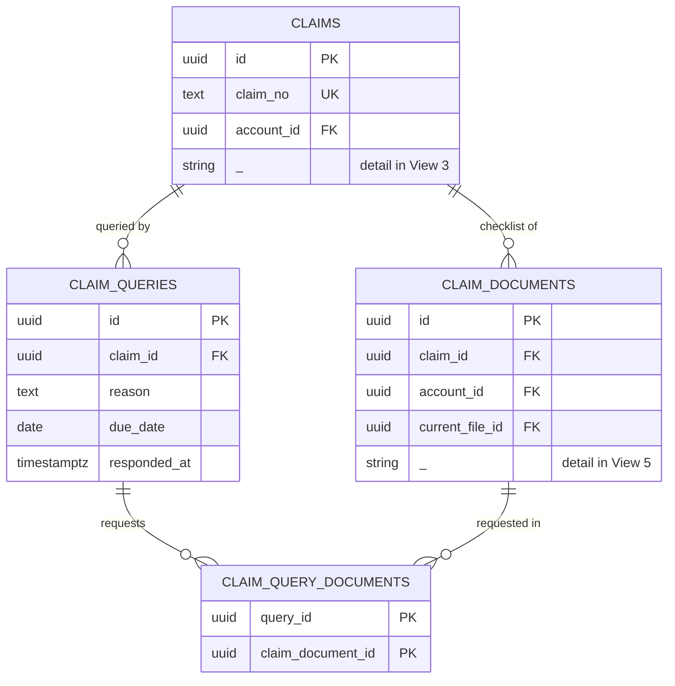
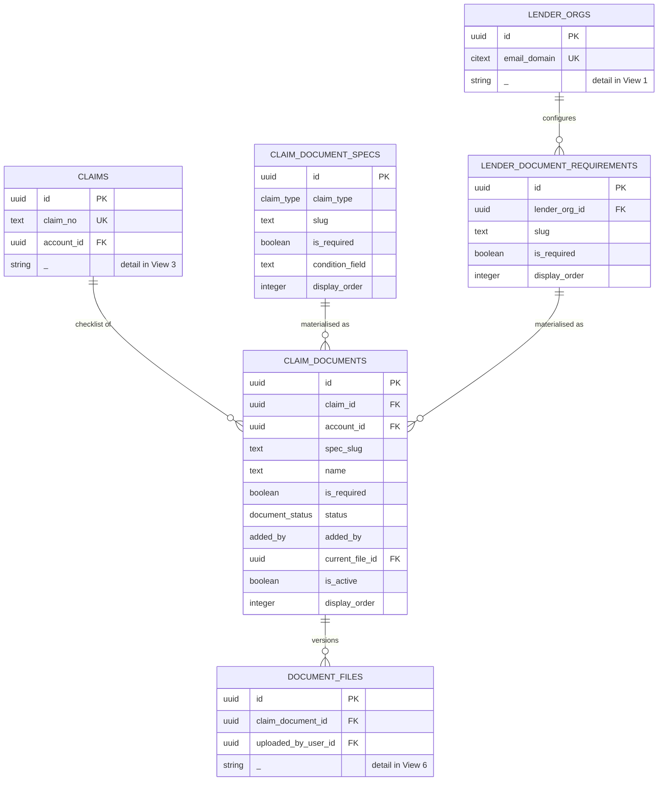
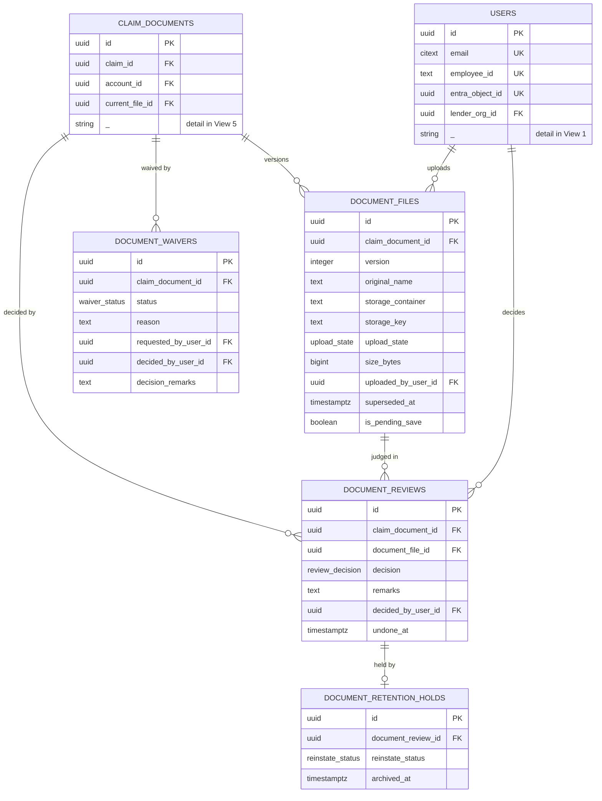
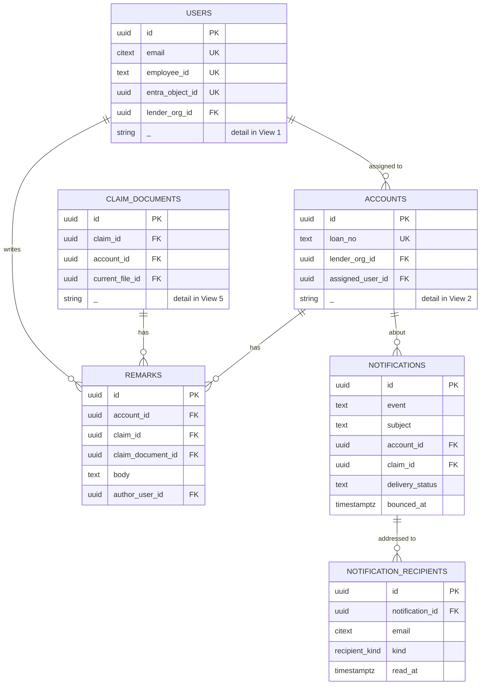
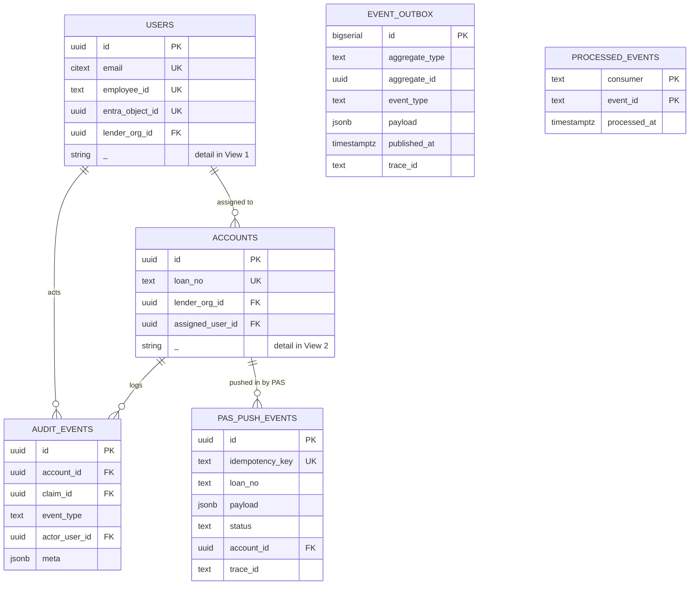
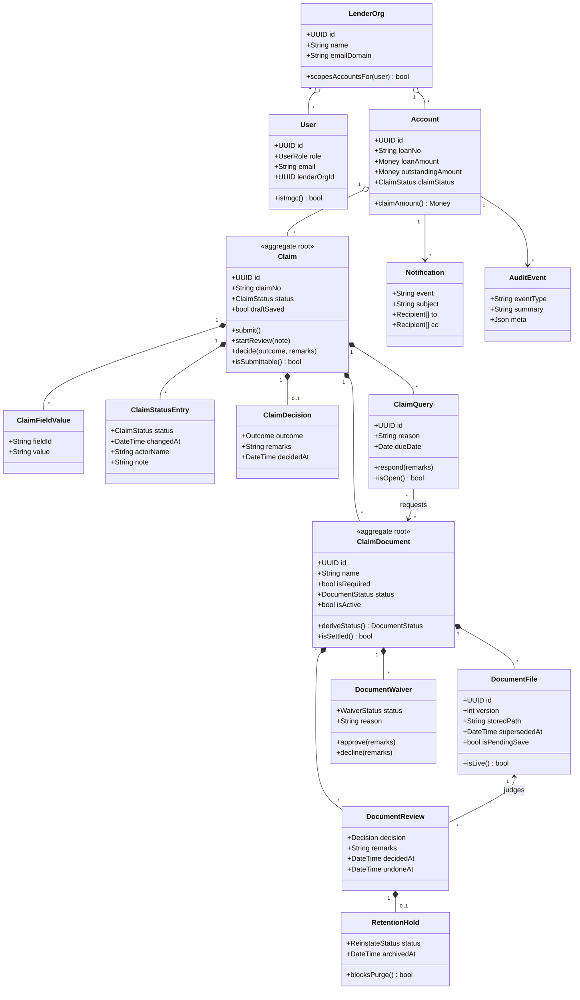

# DB Design Document

**Status:** source of truth for all database work on the IMGC lender portal.
**Last revised:** 28 September 2026.
**Target platform:** PostgreSQL 16 or later.
**Aligned to the Phase 1 (MVP) component stack:** Azure Database for PostgreSQL 16, Microsoft Entra
ID for sign-in, Azure Blob Storage with pre-signed URLs, Kafka on Azure Event Hubs and Azure
Service Bus for events, Azure Managed Redis for token caching, and Azure Monitor / Application
Insights for tracing. Decisions are recorded in A.11 and applied throughout.

This document has two parts.

- **Part A — Target production schema.** The relational design the application moves to. This is
  the authority: migrations, ORM models, queries and reviews follow it, and any change to the
  database starts by changing this document.
- **Part B — Current state and the mapping to it.** What the code stores today (one JSON document)
  and how each part of it lands in Part A. This is the migration contract.

Everything in Part B is read from the code. Everything in Part A is a design decision derived from
that code. Where the code does not settle a question, it is marked **Not confirmed** and listed in
section A.12 rather than guessed at.

---

# Part A — Target production schema

## A.1 Conventions

These apply to every table below; they are not repeated per table.

| Rule               | Decision                                                                                                                                                     |
| ------------------ | ------------------------------------------------------------------------------------------------------------------------------------------------------------ |
| Naming             | `snake_case`; tables plural (`claims`), columns singular (`claim_no`)                                                                                        |
| Primary keys       | `id uuid PRIMARY KEY DEFAULT gen_random_uuid()` (pgcrypto)                                                                                                   |
| Business keys      | Separate from the PK and unique in their own right (`accounts.loan_no`, `claims.claim_no`)                                                                   |
| Timestamps         | `timestamptz`, never `timestamp`; `created_at timestamptz NOT NULL DEFAULT now()`                                                                            |
| Dates without time | `date` (e.g. `sanction_date`, a payment date entered by a person)                                                                                            |
| Money              | `numeric(15,2)`, rupees. Never `float`                                                                                                                       |
| Actor columns      | Always a pair: `*_by_user_id uuid REFERENCES users(id)` plus `*_by_name text` — the id for joins, the name captured at the time so history survives a rename |
| Enumerations       | Native Postgres `ENUM` types (section A.3)                                                                                                                   |
| Deletes            | No hard deletes of business records. Withdrawal is `is_active = false`; replacement is `superseded_at`                                                       |
| FK behaviour       | `ON DELETE RESTRICT` by default; `ON DELETE CASCADE` only for rows that cannot exist alone (child lists, history)                                            |
| Row versioning     | `updated_at timestamptz NOT NULL DEFAULT now()`, maintained by a trigger, on every mutable table                                                             |

## A.2 Table inventory

28 tables in seven groups.

| #   | Table                          | Group         | Purpose                                                       |
| --- | ------------------------------ | ------------- | ------------------------------------------------------------- |
| 1   | `lender_orgs`                  | Identity      | A lender institution — the tenant boundary                    |
| 2   | `lender_org_contacts`          | Identity      | Stakeholder mailboxes per lender                              |
| 3   | `users`                        | Identity      | IMGC staff and lender users                                   |
| 4   | `user_password_history`        | Identity      | Previous password hashes, so a reset cannot reuse one         |
| 5   | `auth_otps`                    | Identity      | One-time sign-in codes for lender users                       |
| 6   | `accounts`                     | Loan          | The loan/application a claim is made against                  |
| 7   | `account_push_recipients`      | Loan          | Extra mailboxes pinned to one account                         |
| 8   | `pas_values`                   | Loan          | Values pushed in from PAS                                     |
| 9   | `claims`                       | Claim         | A claim against an account                                    |
| 10  | `claim_field_values`           | Claim         | Config-defined form values for a claim                        |
| 11  | `claim_status_history`         | Claim         | Every status transition, append-only                          |
| 12  | `claim_decisions`              | Claim         | The approved / ineligible outcome                             |
| 13  | `claim_queries`                | Claim         | A query IMGC raises and the lender's response                 |
| 14  | `claim_query_documents`        | Claim         | Documents a query asks for                                    |
| 15  | `claim_documents`              | Document      | One checklist row on a claim                                  |
| 16  | `document_files`               | Document      | An uploaded file version                                      |
| 17  | `document_reviews`             | Document      | IMGC's accept/reject decisions, append-only                   |
| 18  | `document_waivers`             | Document      | A request to proceed without a document, and its decision     |
| 19  | `document_retention_holds`     | Document      | Reinstatement requests and archive flags on rejected material |
| 20  | `claim_document_specs`         | Configuration | The default checklist per claim type                          |
| 21  | `lender_document_requirements` | Configuration | Per-lender checklist that replaces the default                |
| 22  | `remarks`                      | Collaboration | Free-text remarks at account, claim or document level         |
| 23  | `notifications`                | Collaboration | One message, with its recipients                              |
| 24  | `notification_recipients`      | Collaboration | To/CC and read state per address                              |
| 25  | `audit_events`                 | Collaboration | Append-only activity log                                      |
| 26  | `event_outbox`                 | Platform      | Events awaiting publication to Kafka / Service Bus            |
| 27  | `processed_events`             | Platform      | Events already consumed, so a redelivery cannot double-apply  |
| 28  | `pas_push_events`              | Platform      | Every loan pushed in by PAS, and what became of it            |

## A.3 Enumerations

Native enum types, created before the tables. Values are exactly those the code uses today
(`src/server/mock/types.ts`).

```sql
CREATE TYPE user_role        AS ENUM ('IMGC', 'LENDER');
CREATE TYPE actor_role       AS ENUM ('IMGC', 'LENDER', 'SYSTEM');
CREATE TYPE claim_type       AS ENUM ('INITIAL', 'SUBSEQUENT');
CREATE TYPE claim_status     AS ENUM (
  'NOT_STARTED', 'DRAFT', 'INITIATED', 'QUERY_INITIATED', 'UNDER_REVIEW',
  'QUERY_UNDER_REVIEW', 'APPROVED', 'INELIGIBLE'
);
CREATE TYPE document_status  AS ENUM (
  'NOT_REQUESTED', 'PENDING_UPLOAD', 'UNDER_REVIEW', 'APPROVED',
  'REJECTED', 'REUPLOAD_REQUIRED', 'WAIVER_REQUESTED', 'WAIVED'
);
CREATE TYPE review_decision  AS ENUM ('APPROVED', 'REJECTED', 'REUPLOAD_REQUESTED');
CREATE TYPE waiver_status    AS ENUM ('REQUESTED', 'APPROVED', 'DENIED');
CREATE TYPE reinstate_status AS ENUM ('REQUESTED', 'APPROVED', 'DENIED');
CREATE TYPE added_by         AS ENUM ('SYSTEM', 'IMGC', 'LENDER');
CREATE TYPE priority         AS ENUM ('LOW', 'NORMAL', 'HIGH', 'URGENT');
CREATE TYPE property_status  AS ENUM ('UNDER_CONSTRUCTION', 'READY_TO_MOVE');
CREATE TYPE recipient_kind   AS ENUM ('TO', 'CC');
CREATE TYPE upload_state     AS ENUM ('PENDING', 'COMMITTED', 'ORPHANED');
```

**`claim_status` holds the eight live statuses and nothing else.** The values the prototype
accumulated — `SUBMITTED`, `QUERY_RAISED`, `DOCUMENTS_RESUBMITTED`, `CLOSED`,
`REFUND_RECEIVED_BY_IMGC` and `REJECTED` — are **not** carried into production. Each is folded into
a live status by the migration (B.2), so no legacy value survives to be written by accident.

Two points of vocabulary:

- **`INELIGIBLE` replaces `REJECTED`.** It is already what the application shows a user
  (`StatusPill` maps `REJECTED` to "Ineligible"); the column now says the same thing.
- **`NOT_STARTED` is a real stored status,** not a display trick. Today it is inferred from a draft
  with no progress (`claimStatusDisplay`); storing it means the grid, the filter and the database
  agree without that inference.

**There is no `party` enum.** Who holds a claim is derived from its status, never stored — A.11.

## A.4 DDL — identity and loan

```sql
CREATE TABLE lender_orgs (
  id            uuid PRIMARY KEY DEFAULT gen_random_uuid(),
  name          text NOT NULL,
  email_domain  citext NOT NULL UNIQUE,      -- the only lender-scoping key
  logo_url      text,
  is_active     boolean NOT NULL DEFAULT true,
  created_at    timestamptz NOT NULL DEFAULT now(),
  updated_at    timestamptz NOT NULL DEFAULT now()
);

CREATE TABLE lender_org_contacts (
  id            uuid PRIMARY KEY DEFAULT gen_random_uuid(),
  lender_org_id uuid NOT NULL REFERENCES lender_orgs(id) ON DELETE CASCADE,
  email         citext NOT NULL,
  created_at    timestamptz NOT NULL DEFAULT now(),
  UNIQUE (lender_org_id, email)
);

CREATE TABLE users (
  id                 uuid PRIMARY KEY DEFAULT gen_random_uuid(),
  role               user_role NOT NULL,
  is_admin           boolean NOT NULL DEFAULT false,
  name               text NOT NULL,
  email              citext NOT NULL UNIQUE,
  employee_id        text UNIQUE,            -- IMGC staff only
  -- Entra ID is the way in (A.11 decision 13). The object id is the identity, not the email:
  -- an address can be reassigned, the object id cannot.
  entra_object_id      uuid UNIQUE,
  user_principal_name  citext,
  identity_provider    text NOT NULL DEFAULT 'ENTRA_ID',  -- 'ENTRA_ID' | 'LOCAL' (fallback)
  invited_at           timestamptz,          -- external-identity onboarding for lender users
  activated_at         timestamptz,
  password_hash      text,                   -- fallback sign-in only; empty under Entra
  phone              text,
  lender_org_id      uuid REFERENCES lender_orgs(id) ON DELETE RESTRICT,
  is_active          boolean NOT NULL DEFAULT true,
  -- Password policy — IMGC staff only; lender users sign in with a one-time code.
  password_changed_at  timestamptz,
  must_change_password boolean NOT NULL DEFAULT false,
  failed_attempts      smallint NOT NULL DEFAULT 0,
  last_failed_at       timestamptz,
  locked_until         timestamptz,
  last_login_at        timestamptz,
  created_at         timestamptz NOT NULL DEFAULT now(),
  created_by_user_id uuid REFERENCES users(id),
  updated_at         timestamptz NOT NULL DEFAULT now(),
  -- A lender user belongs to a lender; IMGC staff never do.
  CONSTRAINT users_scope_ck CHECK (
    (role = 'LENDER' AND lender_org_id IS NOT NULL AND employee_id IS NULL)
    OR (role = 'IMGC' AND lender_org_id IS NULL)
  )
);

-- Previous password hashes, so a reset cannot reuse one. Never read for authentication.
CREATE TABLE user_password_history (
  id            uuid PRIMARY KEY DEFAULT gen_random_uuid(),
  user_id       uuid NOT NULL REFERENCES users(id) ON DELETE CASCADE,
  password_hash text NOT NULL,
  changed_at    timestamptz NOT NULL DEFAULT now()
);
CREATE INDEX user_password_history_user_idx ON user_password_history (user_id, changed_at DESC);

CREATE TABLE auth_otps (
  id          uuid PRIMARY KEY DEFAULT gen_random_uuid(),
  email       citext NOT NULL,
  code_hash   text NOT NULL,
  salt        text NOT NULL,
  expires_at  timestamptz NOT NULL,
  attempts    smallint NOT NULL DEFAULT 0,
  consumed_at timestamptz,
  created_at  timestamptz NOT NULL DEFAULT now()
);
CREATE INDEX auth_otps_email_idx ON auth_otps (email, expires_at DESC);

CREATE TABLE accounts (
  id                    uuid PRIMARY KEY DEFAULT gen_random_uuid(),
  loan_no               text NOT NULL UNIQUE,
  borrower_name         text NOT NULL,
  lender_org_id         uuid NOT NULL REFERENCES lender_orgs(id) ON DELETE RESTRICT,
  assigned_user_id      uuid REFERENCES users(id) ON DELETE SET NULL,
  product               text NOT NULL,
  region                text NOT NULL,
  branch                text NOT NULL,
  application_date      date NOT NULL,
  loan_amount           numeric(15,2) NOT NULL CHECK (loan_amount >= 0),
  outstanding_amount    numeric(15,2) NOT NULL CHECK (outstanding_amount >= 0),
  sanction_date         date NOT NULL,
  disbursement_date     date NOT NULL,
  tenure_months         integer NOT NULL CHECK (tenure_months > 0),
  property_type         text NOT NULL,
  property_status_label text NOT NULL,
  property_status_at_disbursal property_status NOT NULL,
  stage                 text NOT NULL,
  claim_status          claim_status NOT NULL,
  is_npa                boolean NOT NULL DEFAULT false,
  is_written_off        boolean NOT NULL DEFAULT false,
  dpd                   integer,             -- NULL ≠ 0: unknown, not "zero days past due"
  submitted_at          timestamptz,
  last_activity_at      timestamptz,
  -- Where the loan came from, so a PAS-pushed field is distinguishable from a portal entry.
  source_system         text NOT NULL DEFAULT 'PAS',
  pas_last_synced_at    timestamptz,
  created_at            timestamptz NOT NULL DEFAULT now(),
  updated_at            timestamptz NOT NULL DEFAULT now()
);
CREATE INDEX accounts_lender_idx   ON accounts (lender_org_id, claim_status);
CREATE INDEX accounts_assigned_idx ON accounts (assigned_user_id);
CREATE INDEX accounts_activity_idx ON accounts (last_activity_at DESC NULLS LAST);

CREATE TABLE account_push_recipients (
  id         uuid PRIMARY KEY DEFAULT gen_random_uuid(),
  account_id uuid NOT NULL REFERENCES accounts(id) ON DELETE CASCADE,
  email      citext NOT NULL,
  created_at timestamptz NOT NULL DEFAULT now(),
  UNIQUE (account_id, email)
);

CREATE TABLE pas_values (
  id              uuid PRIMARY KEY DEFAULT gen_random_uuid(),
  account_id      uuid NOT NULL REFERENCES accounts(id) ON DELETE CASCADE,
  key             text NOT NULL,
  label           text NOT NULL,
  value           text NOT NULL,
  source          text NOT NULL DEFAULT 'PAS',
  updated_at      timestamptz NOT NULL DEFAULT now(),
  updated_by_name text NOT NULL,
  UNIQUE (account_id, key)
);
```

**`accounts.claim_status` is a denormalised summary** of the account's live claim, kept because
every grid filters and sorts on it. The claim remains the authority; a trigger or the service layer
keeps this column in step. A deliberate duplication, recorded here so it is never mistaken for one.

## A.5 DDL — claim

```sql
CREATE TABLE claims (
  id                 uuid PRIMARY KEY DEFAULT gen_random_uuid(),
  claim_no           text NOT NULL UNIQUE,
  account_id         uuid NOT NULL REFERENCES accounts(id) ON DELETE RESTRICT,
  claim_type         claim_type NOT NULL,
  status             claim_status NOT NULL,
  draft_saved        boolean NOT NULL DEFAULT false,
  created_by_user_id uuid NOT NULL REFERENCES users(id),
  created_by_name    text NOT NULL,
  created_at         timestamptz NOT NULL DEFAULT now(),
  submitted_at       timestamptz,
  last_updated_at    timestamptz NOT NULL DEFAULT now(),
  -- Only one live claim per account; terminal ones may accumulate.
  CONSTRAINT claims_account_live_uq EXCLUDE (account_id WITH =)
    WHERE (status NOT IN ('APPROVED','INELIGIBLE'))
);
CREATE INDEX claims_account_idx ON claims (account_id, status);
CREATE INDEX claims_status_idx  ON claims (status, last_updated_at DESC);

CREATE TABLE claim_field_values (
  claim_id   uuid NOT NULL REFERENCES claims(id) ON DELETE CASCADE,
  field_id   text NOT NULL,                  -- matches a claimConfig field id
  value      text NOT NULL,
  updated_at timestamptz NOT NULL DEFAULT now(),
  PRIMARY KEY (claim_id, field_id)
);

CREATE TABLE claim_status_history (
  id            uuid PRIMARY KEY DEFAULT gen_random_uuid(),
  claim_id      uuid NOT NULL REFERENCES claims(id) ON DELETE CASCADE,
  status        claim_status NOT NULL,
  changed_at    timestamptz NOT NULL DEFAULT now(),
  actor_user_id uuid REFERENCES users(id),   -- NULL when actor_role = 'SYSTEM'
  actor_name    text NOT NULL,
  actor_role    actor_role NOT NULL,
  note          text
);
CREATE INDEX claim_status_history_claim_idx ON claim_status_history (claim_id, changed_at);

CREATE TABLE claim_decisions (
  claim_id           uuid PRIMARY KEY REFERENCES claims(id) ON DELETE CASCADE,
  outcome            claim_status NOT NULL
                     CHECK (outcome IN ('APPROVED','INELIGIBLE')),
  decided_by_user_id uuid NOT NULL REFERENCES users(id),
  decided_by_name    text NOT NULL,
  decided_at         timestamptz NOT NULL DEFAULT now(),
  remarks            text NOT NULL
);

CREATE TABLE claim_queries (
  id                   uuid PRIMARY KEY DEFAULT gen_random_uuid(),
  claim_id             uuid NOT NULL REFERENCES claims(id) ON DELETE CASCADE,
  reason               text NOT NULL,
  remarks              text NOT NULL DEFAULT '',
  raised_by_user_id    uuid NOT NULL REFERENCES users(id),
  raised_by_name       text NOT NULL,
  raised_at            timestamptz NOT NULL DEFAULT now(),
  due_date             date,
  responded_at         timestamptz,
  responded_by_user_id uuid REFERENCES users(id),
  responded_by_name    text,
  response_remarks     text,
  CONSTRAINT claim_queries_response_ck CHECK (
    (responded_at IS NULL AND responded_by_user_id IS NULL)
    OR (responded_at IS NOT NULL AND responded_by_user_id IS NOT NULL)
  )
);
CREATE INDEX claim_queries_open_idx ON claim_queries (claim_id) WHERE responded_at IS NULL;

-- Which documents a query asks for. Today the code stores document NAMES; a real reference is
-- half the reason for moving to a relational store.
CREATE TABLE claim_query_documents (
  query_id          uuid NOT NULL REFERENCES claim_queries(id) ON DELETE CASCADE,
  claim_document_id uuid NOT NULL REFERENCES claim_documents(id) ON DELETE CASCADE,
  PRIMARY KEY (query_id, claim_document_id)
);
```

## A.6 DDL — documents

```sql
CREATE TABLE claim_documents (
  id                  uuid PRIMARY KEY DEFAULT gen_random_uuid(),
  claim_id            uuid NOT NULL REFERENCES claims(id) ON DELETE CASCADE,
  account_id          uuid NOT NULL REFERENCES accounts(id) ON DELETE RESTRICT,  -- denormalised for lender scoping
  spec_slug           text,                  -- ties back to the configured document
  name                text NOT NULL,
  category            text,
  description         text,
  is_required         boolean NOT NULL,
  is_conditional      boolean NOT NULL DEFAULT false,
  condition_reason    text,
  allows_multiple     boolean NOT NULL DEFAULT false,
  status              document_status NOT NULL DEFAULT 'PENDING_UPLOAD',
  added_by            added_by NOT NULL,
  added_by_name       text,
  priority            priority,
  due_date            date,
  requirement_remarks text,
  reference_no        text,                  -- "AD-001" for lender-added documents
  display_order       integer NOT NULL DEFAULT 0,
  is_active           boolean NOT NULL DEFAULT true,   -- false = withdrawn
  current_file_id     uuid REFERENCES document_files(id) ON DELETE SET NULL,
  created_at          timestamptz NOT NULL DEFAULT now(),
  updated_at          timestamptz NOT NULL DEFAULT now()
);
CREATE INDEX claim_documents_claim_idx  ON claim_documents (claim_id, display_order);
CREATE INDEX claim_documents_status_idx ON claim_documents (status) WHERE is_active;

CREATE TABLE document_files (
  id                  uuid PRIMARY KEY DEFAULT gen_random_uuid(),
  claim_document_id   uuid NOT NULL REFERENCES claim_documents(id) ON DELETE CASCADE,
  version             integer NOT NULL CHECK (version >= 1),
  original_name       text NOT NULL,
  -- Azure Blob Storage (A.11 decision 14). The blob is addressed by container + key; the
  -- pre-signed URL that reaches it is minted per request and never stored.
  storage_provider    text NOT NULL DEFAULT 'AZURE_BLOB',
  storage_container   text NOT NULL,
  storage_key         text NOT NULL,         -- blob name within the container
  storage_etag        text,                  -- Azure's ETag, to spot a blob changed underneath us
  stored_path         text NOT NULL,         -- provider-neutral locator, derived from the two above
  size_bytes          bigint NOT NULL CHECK (size_bytes > 0),
  mime_type           text NOT NULL,
  checksum_sha256     text,
  document_number     text,
  document_date       date,
  upload_remarks      text,
  uploaded_by_user_id uuid NOT NULL REFERENCES users(id),
  uploaded_by_name    text NOT NULL,
  uploaded_by_role    user_role NOT NULL,
  uploaded_at         timestamptz NOT NULL DEFAULT now(),
  superseded_at       timestamptz,
  superseded_reason   text,
  is_pending_save     boolean NOT NULL DEFAULT false,  -- draft upload not yet kept by Save Draft
  -- The browser uploads straight to Azure, so the row exists before the blob is known to be there.
  upload_state        upload_state NOT NULL DEFAULT 'PENDING',
  upload_expires_at   timestamptz,           -- when the issued URL dies; a sweep cleans up after
  committed_at        timestamptz,           -- server verified size + checksum against the blob
  -- Retention spans two systems: the row is marked, then the blob delete is confirmed.
  deleted_at          timestamptz,
  purge_confirmed_at  timestamptz,
  UNIQUE (claim_document_id, version),
  UNIQUE (storage_container, storage_key)
);
CREATE INDEX document_files_orphan_idx ON document_files (upload_expires_at)
  WHERE upload_state = 'PENDING';
CREATE INDEX document_files_purge_idx ON document_files (deleted_at)
  WHERE deleted_at IS NOT NULL AND purge_confirmed_at IS NULL;
CREATE INDEX document_files_live_idx ON document_files (claim_document_id)
  WHERE superseded_at IS NULL;

-- Append-only. An "undo" writes nothing away: it stamps undone_at, and the document's status is
-- derived from the live decisions (deriveDocumentStatus today).
CREATE TABLE document_reviews (
  id                 uuid PRIMARY KEY DEFAULT gen_random_uuid(),
  claim_document_id  uuid NOT NULL REFERENCES claim_documents(id) ON DELETE CASCADE,
  document_file_id   uuid REFERENCES document_files(id) ON DELETE CASCADE,  -- NULL = document-level (legacy)
  decision           review_decision NOT NULL,
  remarks            text NOT NULL,          -- mandatory for REJECTED / REUPLOAD_REQUESTED
  against_version    integer,                -- the file version judged
  decided_by_user_id uuid NOT NULL REFERENCES users(id),
  decided_by_name    text NOT NULL,
  decided_at         timestamptz NOT NULL DEFAULT now(),
  undone_at          timestamptz,
  undone_by_user_id  uuid REFERENCES users(id),
  CONSTRAINT document_reviews_remarks_ck
    CHECK (decision = 'APPROVED' OR length(btrim(remarks)) > 0)
);
CREATE INDEX document_reviews_file_idx ON document_reviews (document_file_id, decided_at DESC);
CREATE INDEX document_reviews_live_idx ON document_reviews (claim_document_id)
  WHERE undone_at IS NULL;

CREATE TABLE document_waivers (
  id                   uuid PRIMARY KEY DEFAULT gen_random_uuid(),
  claim_document_id    uuid NOT NULL REFERENCES claim_documents(id) ON DELETE CASCADE,
  status               waiver_status NOT NULL DEFAULT 'REQUESTED',
  reason               text NOT NULL,
  requested_by_user_id uuid NOT NULL REFERENCES users(id),
  requested_by_name    text NOT NULL,
  requested_at         timestamptz NOT NULL DEFAULT now(),
  decided_by_user_id   uuid REFERENCES users(id),
  decided_by_name      text,
  decided_at           timestamptz,
  decision_remarks     text,
  CONSTRAINT document_waivers_decision_ck CHECK (
    (status = 'REQUESTED' AND decided_at IS NULL)
    OR (status <> 'REQUESTED' AND decided_at IS NOT NULL)
  ),
  CONSTRAINT document_waivers_denial_ck
    CHECK (status <> 'DENIED' OR length(btrim(coalesce(decision_remarks,''))) > 0)
);
-- One open request at a time per document.
CREATE UNIQUE INDEX document_waivers_open_uq ON document_waivers (claim_document_id)
  WHERE status = 'REQUESTED';

-- Retention: a rejected file is purged after its window unless held or archived.
CREATE TABLE document_retention_holds (
  id                   uuid PRIMARY KEY DEFAULT gen_random_uuid(),
  document_review_id   uuid NOT NULL REFERENCES document_reviews(id) ON DELETE CASCADE,
  reinstate_status     reinstate_status,
  requested_by_user_id uuid REFERENCES users(id),
  requested_by_name    text,
  requested_at         timestamptz,
  decided_by_user_id   uuid REFERENCES users(id),
  decided_by_name      text,
  decided_at           timestamptz,
  note                 text,
  archived_at          timestamptz,          -- archived = never purged
  archived_by_name     text,
  UNIQUE (document_review_id)
);
```

## A.7 DDL — configuration

```sql
-- The built-in checklist a claim type ships with (today in src/config/claimConfig.ts).
CREATE TABLE claim_document_specs (
  id                 uuid PRIMARY KEY DEFAULT gen_random_uuid(),
  claim_type         claim_type NOT NULL,
  slug               text NOT NULL,
  name               text NOT NULL,
  category           text NOT NULL,
  description        text,
  is_required        boolean NOT NULL,
  allows_multiple    boolean NOT NULL DEFAULT false,
  condition_field    text,                   -- conditional rule: field / operator / value
  condition_operator text,
  condition_value    text,
  display_order      integer NOT NULL,
  is_active          boolean NOT NULL DEFAULT true,
  UNIQUE (claim_type, slug)
);

-- A lender with rows here gets exactly this list instead of the default.
CREATE TABLE lender_document_requirements (
  id            uuid PRIMARY KEY DEFAULT gen_random_uuid(),
  lender_org_id uuid NOT NULL REFERENCES lender_orgs(id) ON DELETE CASCADE,
  slug          text NOT NULL,
  name          text NOT NULL,
  category      text NOT NULL,
  description   text,
  is_required   boolean NOT NULL,
  display_order integer NOT NULL,
  created_at    timestamptz NOT NULL DEFAULT now(),
  updated_at    timestamptz NOT NULL DEFAULT now(),
  UNIQUE (lender_org_id, slug)
);
```

## A.8 DDL — collaboration

```sql
CREATE TABLE remarks (
  id                uuid PRIMARY KEY DEFAULT gen_random_uuid(),
  account_id        uuid NOT NULL REFERENCES accounts(id) ON DELETE CASCADE,
  claim_id          uuid REFERENCES claims(id) ON DELETE CASCADE,
  claim_document_id uuid REFERENCES claim_documents(id) ON DELETE CASCADE,
  source            text,                    -- e.g. 'CLAIM_INITIATION'
  body              text NOT NULL,
  author_user_id    uuid NOT NULL REFERENCES users(id),
  author_name       text NOT NULL,
  author_role       user_role NOT NULL,
  created_at        timestamptz NOT NULL DEFAULT now()
);
CREATE INDEX remarks_account_idx ON remarks (account_id, created_at DESC);

CREATE TABLE notifications (
  id              uuid PRIMARY KEY DEFAULT gen_random_uuid(),
  event           text NOT NULL,
  subject         text NOT NULL,
  body            text NOT NULL,
  account_id      uuid REFERENCES accounts(id) ON DELETE SET NULL,
  claim_id        uuid REFERENCES claims(id) ON DELETE SET NULL,
  sent_at             timestamptz NOT NULL DEFAULT now(),
  -- Email is delivered for real (A.11): QUEUED → SENT → DELIVERED, or BOUNCED / FAILED.
  delivery_status     text NOT NULL DEFAULT 'QUEUED',
  provider_message_id text,
  sent_to_provider_at timestamptz,
  delivered_at        timestamptz,
  bounced_at          timestamptz,
  bounce_type         text,                  -- hard / soft, as the provider reports it
  delivery_error      text,
  trace_id            text
);
CREATE INDEX notifications_bounced_idx ON notifications (bounced_at) WHERE bounced_at IS NOT NULL;
CREATE INDEX notifications_account_idx ON notifications (account_id, sent_at DESC);

-- To/CC, and who has read it. Replaces three string arrays.
CREATE TABLE notification_recipients (
  id              uuid PRIMARY KEY DEFAULT gen_random_uuid(),
  notification_id uuid NOT NULL REFERENCES notifications(id) ON DELETE CASCADE,
  email           citext NOT NULL,
  kind            recipient_kind NOT NULL,
  recipient_role  user_role,
  read_at         timestamptz,
  UNIQUE (notification_id, email, kind)
);

CREATE TABLE audit_events (
  id            uuid PRIMARY KEY DEFAULT gen_random_uuid(),
  account_id    uuid REFERENCES accounts(id) ON DELETE SET NULL,
  claim_id      uuid REFERENCES claims(id) ON DELETE SET NULL,
  occurred_at   timestamptz NOT NULL DEFAULT now(),
  actor_user_id uuid REFERENCES users(id),
  actor_name    text NOT NULL,
  actor_role    actor_role NOT NULL,
  event_type    text NOT NULL,
  summary       text NOT NULL,
  meta          jsonb NOT NULL DEFAULT '{}'::jsonb,
  -- "Trace ID and Span ID visible across all layers" — including the row the request produced.
  trace_id      text,
  span_id       text
);
CREATE INDEX audit_events_account_idx ON audit_events (account_id, occurred_at DESC);
CREATE INDEX audit_events_type_idx    ON audit_events (event_type, occurred_at DESC);
```

`audit_events.event_type` stays `text` rather than an enum: the list grows with every feature, and
a new event should not need a schema migration. `meta` is `jsonb` for the same reason.

## A.8a DDL — platform

These three tables exist because of the Phase 1 stack: Kafka on Event Hubs and Service Bus for
events, and the PAS Push API for loan intake.

```sql
-- Transactional outbox. An event is written in the same transaction as the business change it
-- describes, then relayed to Kafka / Service Bus. Without this, a crash between the commit and
-- the publish loses the event with no trace.
CREATE TABLE event_outbox (
  id             bigserial PRIMARY KEY,
  aggregate_type text NOT NULL,              -- 'claim', 'claim_document', 'account'
  aggregate_id   uuid NOT NULL,
  event_type     text NOT NULL,              -- 'ClaimSubmitted', 'DocumentRejected', …
  payload        jsonb NOT NULL,
  occurred_at    timestamptz NOT NULL DEFAULT now(),
  published_at   timestamptz,
  attempts       smallint NOT NULL DEFAULT 0,
  last_error     text,
  trace_id       text
);
CREATE INDEX event_outbox_unpublished_idx ON event_outbox (occurred_at)
  WHERE published_at IS NULL;

-- Consumer side: at-least-once delivery means the same event can arrive twice.
CREATE TABLE processed_events (
  consumer     text NOT NULL,                -- which service consumed it
  event_id     text NOT NULL,                -- the broker's message id
  processed_at timestamptz NOT NULL DEFAULT now(),
  PRIMARY KEY (consumer, event_id)
);

-- Every loan PAS pushes in, and what became of it. The payload is kept as received, so a dispute
-- about what was sent is settled by the record rather than by memory.
CREATE TABLE pas_push_events (
  id              uuid PRIMARY KEY DEFAULT gen_random_uuid(),
  idempotency_key text NOT NULL UNIQUE,      -- a retry cannot create a second account
  received_at     timestamptz NOT NULL DEFAULT now(),
  loan_no         text NOT NULL,             -- as sent, before any matching
  payload         jsonb NOT NULL,
  status          text NOT NULL DEFAULT 'RECEIVED',  -- RECEIVED | APPLIED | REJECTED
  account_id      uuid REFERENCES accounts(id) ON DELETE SET NULL,
  error           text,
  processed_at    timestamptz,
  trace_id        text
);
CREATE INDEX pas_push_events_loan_idx   ON pas_push_events (loan_no, received_at DESC);
CREATE INDEX pas_push_events_status_idx ON pas_push_events (status) WHERE status <> 'APPLIED';
```

The outbox is deliberately `bigserial` rather than `uuid`: the relay reads it in insertion order,
and a monotonic key is what makes that cheap.

## A.9 ERD — target schema

The whole schema on one page is a wall chart, not a diagram anyone reads. It is drawn here as
**eight views of five or six tables each**, plus a map. Every view is generated from the same
master ERD, so no view can show a column or a relationship the schema does not have.

**How to read a view.** Tables the view is _about_ are drawn in full. A table shown only for
context carries its key columns and a note saying which view holds its detail — follow the link
under the diagram to get there.

### A.9.0 Map — how the views connect



| View                              | Tables in full                                                                       | Jump          |
| --------------------------------- | ------------------------------------------------------------------------------------ | ------------- |
| 1. Identity and access            | `lender_orgs`, `lender_org_contacts`, `users`, `user_password_history`, `auth_otps`  | [open](#a9v1) |
| 2. Accounts (the loan)            | `accounts`, `account_push_recipients`, `pas_values`                                  | [open](#a9v2) |
| 3. Claim core                     | `claims`, `claim_field_values`, `claim_status_history`, `claim_decisions`            | [open](#a9v3) |
| 4. Queries                        | `claim_queries`, `claim_query_documents`                                             | [open](#a9v4) |
| 5. The document checklist         | `claim_documents`, `claim_document_specs`, `lender_document_requirements`            | [open](#a9v5) |
| 6. Files, decisions and retention | `document_files`, `document_reviews`, `document_waivers`, `document_retention_holds` | [open](#a9v6) |
| 7. Remarks and notifications      | `remarks`, `notifications`, `notification_recipients`                                | [open](#a9v7) |
| 8. Audit, events and PAS intake   | `audit_events`, `event_outbox`, `processed_events`, `pas_push_events`                | [open](#a9v8) |

<a id="a9v1"></a>

### View 1 — Identity and access

Who the portal knows: the lender institutions, their people, and how those people sign in.



**Goes on to:** `accounts` (owns) → [View 2: Accounts (the loan)](#a9v2) · `lender_document_requirements` (configures) → [View 5: The document checklist](#a9v5) · `document_files` (uploads) → [View 6: Files, decisions and retention](#a9v6) · `document_reviews` (decides) → [View 6: Files, decisions and retention](#a9v6) · `remarks` (writes) → [View 7: Remarks and notifications](#a9v7) · `audit_events` (acts) → [View 8: Audit, events and PAS intake](#a9v8)

[↑ Back to the map](#a90-map--how-the-views-connect)

<a id="a9v2"></a>

### View 2 — Accounts (the loan)

The loan a claim is made against, the mailboxes pinned to it, and the values PAS pushes in.



**Goes on to:** `lender_orgs` (owns) → [View 1: Identity and access](#a9v1) · `users` (assigned to) → [View 1: Identity and access](#a9v1) · `claims` (has) → [View 3: Claim core](#a9v3) · `remarks` (has) → [View 7: Remarks and notifications](#a9v7) · `audit_events` (logs) → [View 8: Audit, events and PAS intake](#a9v8) · `notifications` (about) → [View 7: Remarks and notifications](#a9v7) · `pas_push_events` (pushed in by PAS) → [View 8: Audit, events and PAS intake](#a9v8)

[↑ Back to the map](#a90-map--how-the-views-connect)

<a id="a9v3"></a>

### View 3 — Claim core

A claim, the form values captured on it, every status it has passed through, and its outcome.



**Goes on to:** `accounts` (has) → [View 2: Accounts (the loan)](#a9v2) · `claim_queries` (queried by) → [View 4: Queries](#a9v4) · `claim_documents` (checklist of) → [View 5: The document checklist](#a9v5)

[↑ Back to the map](#a90-map--how-the-views-connect)

<a id="a9v4"></a>

### View 4 — Queries

A query IMGC raises against a claim, the lender's response, and the documents it asks for.



**Goes on to:** `claims` (queried by) → [View 3: Claim core](#a9v3) · `claim_documents` (requested in) → [View 5: The document checklist](#a9v5)

[↑ Back to the map](#a90-map--how-the-views-connect)

<a id="a9v5"></a>

### View 5 — The document checklist

What a claim must produce: the configured defaults, the per-lender list that replaces them, and the rows a claim ends up with.



**Goes on to:** `lender_orgs` (configures) → [View 1: Identity and access](#a9v1) · `claims` (checklist of) → [View 3: Claim core](#a9v3) · `claim_query_documents` (requested in) → [View 4: Queries](#a9v4) · `document_files` (versions) → [View 6: Files, decisions and retention](#a9v6) · `document_reviews` (decided by) → [View 6: Files, decisions and retention](#a9v6) · `document_waivers` (waived by) → [View 6: Files, decisions and retention](#a9v6) · `remarks` (has) → [View 7: Remarks and notifications](#a9v7)

[↑ Back to the map](#a90-map--how-the-views-connect)

<a id="a9v6"></a>

### View 6 — Files, decisions and retention

What was uploaded, what IMGC decided about it, what was waived instead, and what stops a rejected file being purged.



**Goes on to:** `claim_documents` (versions) → [View 5: The document checklist](#a9v5) · `users` (uploads) → [View 1: Identity and access](#a9v1)

[↑ Back to the map](#a90-map--how-the-views-connect)

<a id="a9v7"></a>

### View 7 — Remarks and notifications

What people wrote, and who was told about it.



**Goes on to:** `accounts` (has) → [View 2: Accounts (the loan)](#a9v2) · `claim_documents` (has) → [View 5: The document checklist](#a9v5) · `users` (writes) → [View 1: Identity and access](#a9v1)

[↑ Back to the map](#a90-map--how-the-views-connect)

<a id="a9v8"></a>

### View 8 — Audit, events and PAS intake

What the system recorded, the outbox feeding Kafka and Service Bus, the consumer's ledger, and every loan PAS pushes in.



**Goes on to:** `accounts` (logs) → [View 2: Accounts (the loan)](#a9v2) · `users` (acts) → [View 1: Identity and access](#a9v1)

[↑ Back to the map](#a90-map--how-the-views-connect)

## A.10 UML — domain model

Aggregates and their behaviour, as the service layer sees them.



**Invariants the schema enforces, or the service must:**

1. **A document's status is derived, never set directly.** `claim_documents.status` follows from
   its live files' reviews and any approved waiver (`deriveDocumentStatus` today).
2. **A claim is submittable** when every active required document is `APPROVED`, `WAIVED`, or has an
   open waiver request.
3. **Review can start** only when every active required document is `APPROVED` or `WAIVED`.
4. **One live claim per account** — the exclusion constraint on `claims`.
5. **One open waiver per document** — the partial unique index.
6. **A rejection and a declined waiver both need a remark** — check constraints.
7. **Lender scoping** is by `accounts.lender_org_id` against the user's `lender_org_id`, never from
   anything the client sends.

## A.11 Decisions taken

Settled on 28 September 2026. These are decisions, not proposals; the DDL above already reflects
them.

**1. Single tenant.** This is not a multi-tenant application. **One database, one deployment, no
tenant column and no per-tenant database.** Lenders are data inside it (`lender_orgs`), not
tenants: a lender sees only their own accounts because `accounts.lender_org_id` matches their
user's lender, which is ordinary row filtering. The multi-tenant machinery in the application
template (host-based tenant resolution) is not used by the database design.

Row-level security is still worth adding on `accounts`, `claims`, `claim_documents`,
`document_files`, `remarks` and `notifications`, keyed on the session's lender — as a second line
behind the service checks, not as tenancy.

**2. Retention stays fixed at 90 days.** A constant in code, not a settings table. A rejected
document is purged 90 days after its rejection unless a `document_retention_holds` row blocks it.
If it ever becomes per-lender policy, it becomes a column on `lender_orgs`, not a new table.

**3. The refund module is withdrawn.** Its UI was removed on 24 September 2026 and it is not
coming back, so **no `claim_refund_receipts` table ships and no `REFUND_RECEIVED_BY_IMGC` status
exists** — not even as a legacy value. A claim ends at `APPROVED` or `INELIGIBLE`.

**3a. Eight claim statuses, and no others.**

`NOT_STARTED` · `DRAFT` · `INITIATED` · `QUERY_INITIATED` · `UNDER_REVIEW` ·
`QUERY_UNDER_REVIEW` · `APPROVED` · `INELIGIBLE`

These are the statuses the application actually uses, so they are the whole enum. The prototype's
extra values are folded in by the migration and then gone (B.2): `REJECTED` becomes `INELIGIBLE`,
which is the label users already see; `SUBMITTED` becomes `INITIATED`; `QUERY_RAISED` becomes
`QUERY_INITIATED`; `DOCUMENTS_RESUBMITTED` becomes `QUERY_UNDER_REVIEW`; `CLOSED` and
`REFUND_RECEIVED_BY_IMGC` become `APPROVED`, which is the decision underneath each of them.

`NOT_STARTED` becomes a stored value rather than something inferred from an empty draft, so the
grid, the filter and the database give the same answer.

**4. The claim amount stays computed.** 20% of `loan_amount` (`CLAIM_AMOUNT_RATE` in
`src/config/claimConfig.ts`). **Not stored**, so changing the rate can never leave stale rows
behind. Every screen and export derives it the same way.

**5. INITIAL claims only, for now.** `claim_document_specs` is seeded for `INITIAL`. The
`claim_type` enum keeps `SUBSEQUENT` so adding it later is data, not a migration, but nothing is
seeded or tested for it.

**6. Email is delivered for real, and bounces are recorded.** `notifications` carries the
provider's message id and the delivery lifecycle: `QUEUED → SENT → DELIVERED`, or `BOUNCED` /
`FAILED`, with `bounce_type` as the provider reports it. A failure never loses the notification —
the row stays and the portal still shows it. The provider itself is a deployment choice, not a
schema one.

**7. Ownership is derived, not stored.** _Analysed in the code before deciding._ Today the
`bucket` field is written at eight transition points and read in only three places: the dashboard's
"loans with IMGC" tile, the bucket-shift audit event and its notification. Both grids **already
ignore it** and derive the owner from the claim's status (`ownerForStatus` in
`src/config/claimOwner.ts`, added 23 September 2026).

Two sources for one fact is exactly how they drift, and the status is the one that decides what the
user sees. So: **no `current_party` column on `accounts` or `claims`.** The rule lives in one
place:

| Status                                                  | Owner  |
| ------------------------------------------------------- | ------ |
| Not started, Draft, Query Initiated, Query Under Review | Lender |
| Initiated, Under Review, Approved, Rejected             | IMGC   |

The dashboard tile counts claims whose status maps to IMGC. The bucket-shift audit event and its
notification stay — a handover is still worth recording — but they are raised from the status
transition rather than from a stored column.

**8. Actor fields carry both an id and a name.** _Analysed in the code before deciding._ Today's
JSON is inconsistent: `DocumentReview.by` and `FileReview.by` hold a **user id** alongside
`byName`, while `Rejection.by`, `Reinstate.requestedBy`, `Reinstate.decidedBy`, the waiver's `by`
and `decidedBy`, and both `archived.by` fields hold a **display name** only, and
`PasValue.updatedBy` can be the literal `"PAS"`.

Every actor in the target schema is therefore a pair — `*_by_user_id` for joins and
`*_by_name` captured at the time — so history reads correctly after someone is renamed or
deactivated. The migration resolves today's name-only fields against `users.name`; anything
ambiguous or unmatched is reported and loaded with the id left null, never guessed.

**9. IMGC staff have a password policy, enforced in the database's shape.** Lender users are
unaffected — they sign in with a one-time code, and `auth_otps` already limits that with
`attempts` and `expires_at`.

`users` carries the state the policy needs:

| Column                 | Purpose                                                        |
| ---------------------- | -------------------------------------------------------------- |
| `password_changed_at`  | When the password was last set — drives expiry                 |
| `must_change_password` | Forces a change at next sign-in (new account, admin reset)     |
| `failed_attempts`      | Consecutive failures; reset to 0 on success                    |
| `last_failed_at`       | When the last failure was, so a stale count can age out        |
| `locked_until`         | Set when the limit is reached; sign-in refused until it passes |
| `last_login_at`        | Last successful sign-in, for dormant-account review            |

`user_password_history` keeps previous hashes so a reset cannot reuse one. It is never read to
authenticate — only to refuse a repeat.

The numbers are application settings rather than schema, and these are the proposed defaults,
**for confirmation**: expire after 90 days; lock for 30 minutes after 5 consecutive failures;
refuse the last 5 passwords; minimum 12 characters. Changing any of them is configuration, not a
migration.

**13. Microsoft Entra ID is how people sign in; the database holds no secrets by default.** IMGC
staff and lender users (as external identities) authenticate against Entra, and every call carries
a signed token the service validates. `users` therefore stores **who someone is**, not how they
prove it: `entra_object_id` is the identity key, because an email address can be reassigned and an
object id cannot.

**Local password sign-in is kept for now, as a fallback.** `password_hash`, the policy columns and
`user_password_history` all stay, and `auth_otps` stays with them, but `identity_provider` says
which route an account actually uses, and it defaults to `ENTRA_ID`. The fallback exists so the
portal is not locked out during Entra onboarding; once every account is federated, those columns
and both tables can be dropped in one migration. Password expiry, lockout and reuse rules are
Entra's policy for federated accounts, and only apply to the fallback.

**No session table.** Tokens are validated per call and cached in Azure Managed Redis. Sessions
never reach Postgres.

**14. Documents live in Azure Blob Storage, reached by short-lived pre-signed URLs.** The blob is
addressed by `storage_container` + `storage_key`; the SAS URL itself is minted per request and
**never stored** — it is a credential, and it would be stale before it was read. Storage account
keys live in Key Vault, not here.

Because the browser uploads **straight to Azure**, a file row exists before the blob is known to
have arrived. `upload_state` carries that: `PENDING` when the URL is issued, `COMMITTED` once the
service has verified the blob's size and checksum, `ORPHANED` when it never arrived. And because
retention now spans two systems, a purge marks `deleted_at`, deletes the blob, then sets
`purge_confirmed_at` — a failed blob delete stays visible instead of quietly leaving data in Azure.

**15. Events are published through a transactional outbox.** Kafka on Event Hubs and Service Bus
carry the audit and integration events. A business change and its event are written in **one
transaction** to `event_outbox`, and a relay publishes from there. Consumers record what they have
handled in `processed_events`, because at-least-once delivery means the same message can arrive
twice. Without both, a crash between commit and publish loses an audit event, and a redelivery
applies a decision twice.

**16. Trace ids are stored, not only logged.** Application Insights requires the trace id and span
id to be visible across all layers, so `audit_events`, `notifications`, `pas_push_events` and
`event_outbox` each carry `trace_id`. A support question then moves from a log line to the exact
row it produced.

**17. Every PAS push is recorded before it is applied.** `pas_push_events` keeps the payload as
received, with a unique `idempotency_key` so a retried push cannot create a second account, and a
status of `RECEIVED` → `APPLIED` / `REJECTED`. `accounts.source_system` and `pas_last_synced_at`
then say where a loan came from and when it was last refreshed.

**18. Files stay in object storage.** The database holds the locator and a checksum. No `bytea`.

**19. Migrations are forward-only,** run by **Flyway or Liquibase** from the Spring Boot services,
in version control, named `V<n>__description.sql`. No schema change reaches an environment any
other way. The database is owned by the services that write it; nothing else runs DDL.

**20. Archival.** `audit_events` and `notifications` grow without limit. Partition by month once
either passes roughly 10 million rows.

## A.12 Still open

Nothing. Every question raised in review is settled in A.11.

# Part B — Current state and mapping

## B.1 How data is stored today

One SQL table, confirmed from `src/server/mock/storage.ts`:

| Table            | Column       | Key | Notes                                                                          |
| ---------------- | ------------ | --- | ------------------------------------------------------------------------------ |
| `imgc_snapshots` | `name`       | PK  | Row key, namespaced: `db`, `v2:db`, `dev-ved:db`, plus matching `…:audit` rows |
|                  | `version`    | —   | Incremented per write; optimistic concurrency                                  |
|                  | `data`       | —   | The **entire** application database as one JSON document                       |
|                  | `updated_at` | —   | Write time                                                                     |

Two rows per deployment (`SnapshotName = "db" | "audit"` in `storage.ts`): the database, and the
audit log kept apart because it only grows (`db.ts`).

**There are no foreign keys, indexes or constraints today.** Every relationship is enforced by
application code doing `.find(...)` by id. The exact DDL of `imgc_snapshots` is **Not confirmed** —
no migration file exists; the table was created by hand.

## B.2 Mapping — today's JSON to the target tables

| Today (`MockDb`, `types.ts`)                 | Target table(s)                                 | Notes on the move                                                                                                                                                                                                                                                                 |
| -------------------------------------------- | ----------------------------------------------- | --------------------------------------------------------------------------------------------------------------------------------------------------------------------------------------------------------------------------------------------------------------------------------- |
| `lenderOrgs[]`                               | `lender_orgs` + `lender_org_contacts`           | `contactEmails[]` becomes rows                                                                                                                                                                                                                                                    |
| `users[]`                                    | `users`                                         | The role/lender rule becomes a check constraint; `entra_object_id` is filled by matching each email to Entra and reported where it cannot be matched; password-policy columns start empty, with `password_changed_at` set to the import date so fallback expiry runs from go-live |
| _(no source)_                                | `user_password_history`                         | Starts empty; fills from the first password change after go-live                                                                                                                                                                                                                  |
| _(no source)_                                | `event_outbox`, `processed_events`              | Start empty; the relay fills them from go-live                                                                                                                                                                                                                                    |
| _(no source)_                                | `pas_push_events`                               | Starts empty; fills from the first PAS push after go-live                                                                                                                                                                                                                         |
| `otps[]`                                     | `auth_otps`                                     | Gains a surrogate id; `consumed` becomes `consumed_at`                                                                                                                                                                                                                            |
| `accounts[]`                                 | `accounts` + `account_push_recipients`          | `pushRecipients[]` becomes rows                                                                                                                                                                                                                                                   |
| `pasValues[]`                                | `pas_values`                                    | Unchanged apart from keys                                                                                                                                                                                                                                                         |
| `claims[]`                                   | `claims`                                        | Embedded parts split out, below; **status remapped** — see B.2.1                                                                                                                                                                                                                  |
| `claims[].fields`                            | `claim_field_values`                            | One row per field id                                                                                                                                                                                                                                                              |
| `claims[].statusHistory[]`                   | `claim_status_history`                          | Same shape                                                                                                                                                                                                                                                                        |
| `claims[].decision`                          | `claim_decisions`                               | 1:1                                                                                                                                                                                                                                                                               |
| `claims[].refundReceipt`                     | **Not migrated**                                | The refund module is withdrawn (A.11 decision 3)                                                                                                                                                                                                                                  |
| `claimQueries[]`                             | `claim_queries`                                 | Unchanged                                                                                                                                                                                                                                                                         |
| `claimQueries[].requestedDocuments[]`        | `claim_query_documents`                         | **Names become document ids**                                                                                                                                                                                                                                                     |
| `claimDocuments[]`                           | `claim_documents`                               | `active` → `is_active`; config fields kept                                                                                                                                                                                                                                        |
| `claimDocuments[].review`                    | `document_reviews` (file id NULL)               | Legacy document-level decisions                                                                                                                                                                                                                                                   |
| `claimDocuments[].rejection`                 | `document_reviews` + `document_retention_holds` | Reason to the review; reinstatement and archive to the hold                                                                                                                                                                                                                       |
| `claimDocuments[].rejection.reinstate`       | `document_retention_holds`                      |                                                                                                                                                                                                                                                                                   |
| `claimDocuments[].waiver`                    | `document_waivers`                              | One row per request, so a later second request is possible                                                                                                                                                                                                                        |
| `documentFiles[]`                            | `document_files`                                | `accountId` dropped, reachable through the document; `storedPath` is split into `storage_container` + `storage_key` as each blob is copied into Azure, and every imported row lands `COMMITTED`                                                                                   |
| `documentFiles[].review`                     | `document_reviews`                              | The live decision is the newest row with `undone_at IS NULL`                                                                                                                                                                                                                      |
| `documentFiles[].reviews[]`                  | `document_reviews`                              | Already append-only                                                                                                                                                                                                                                                               |
| `documentFiles[].review.archived`            | `document_retention_holds.archived_at`          |                                                                                                                                                                                                                                                                                   |
| `remarks[]`                                  | `remarks`                                       | Unchanged                                                                                                                                                                                                                                                                         |
| `auditEvents[]` (`audit` snapshot)           | `audit_events`                                  | `meta` becomes `jsonb`                                                                                                                                                                                                                                                            |
| `notifications[]`                            | `notifications` + `notification_recipients`     | `to[]`, `cc[]`, `unreadFor[]` become rows                                                                                                                                                                                                                                         |
| `lenderDocumentRequirements[]`               | `lender_document_requirements`                  | Unchanged                                                                                                                                                                                                                                                                         |
| `CLAIM_TYPES` in `src/config/claimConfig.ts` | `claim_document_specs`                          | A code constant becomes data                                                                                                                                                                                                                                                      |

### B.2.1 Status remapping

Applied to `claims.status`, `accounts.claim_status` and every `claim_status_history` row.

| Stored today              | Loads as             | Why                                                       |
| ------------------------- | -------------------- | --------------------------------------------------------- |
| `DRAFT` with no progress  | `NOT_STARTED`        | What the grid already displays (`claimStatusDisplay`)     |
| `DRAFT` with progress     | `DRAFT`              | Unchanged                                                 |
| `INITIATED`               | `INITIATED`          | Unchanged                                                 |
| `SUBMITTED`               | `INITIATED`          | Same point in the flow; only `INITIATED` is written today |
| `QUERY_INITIATED`         | `QUERY_INITIATED`    | Unchanged                                                 |
| `QUERY_RAISED`            | `QUERY_INITIATED`    | Marked legacy in the code                                 |
| `UNDER_REVIEW`            | `UNDER_REVIEW`       | Unchanged                                                 |
| `QUERY_UNDER_REVIEW`      | `QUERY_UNDER_REVIEW` | Unchanged                                                 |
| `DOCUMENTS_RESUBMITTED`   | `QUERY_UNDER_REVIEW` | The lender has answered; IMGC is reviewing                |
| `APPROVED`                | `APPROVED`           | Unchanged                                                 |
| `REJECTED`                | `INELIGIBLE`         | Rename only — already labelled "Ineligible" in the UI     |
| `CLOSED`                  | `APPROVED`           | Closed follows an approval in every path that sets it     |
| `REFUND_RECEIVED_BY_IMGC` | `APPROVED`           | The decision underneath it; the refund module is gone     |

Counts per source status are recorded before and after, so a remap that lands in the wrong bucket
is visible rather than silent.

**Not migrated:** `Account.bucket` and `Claim.bucket`. Ownership is derived from status (A.11
decision 7), so there is no column to load them into. The bucket-shift audit events already
recorded keep their value as history.

## B.3 Migration approach

1. **Stand up the schema** with the migration tool, on an empty database.
2. **Seed configuration** — `claim_document_specs` from `claimConfig.ts`, then lender requirements.
3. **Import in FK order** — lender orgs, users, accounts, claims, claim documents, files, then
   reviews, waivers, queries, remarks, notifications, audit events. Keep a map from every old string
   id to its new UUID; today's ids are not UUIDs.
4. **Resolve the loose references** — query `requestedDocuments` names to document ids, and every
   name-only actor field to a `users.id` (A.11 decision 8). Anything unmatched is reported and
   loaded with a null id, never guessed and never silently dropped.
5. **Reconcile** — row counts per collection, then spot checks: a claim's document statuses, a
   file's review history, an account's audit trail.
6. **Run both in parallel** for one cycle if the volume warrants it, with the JSON snapshot kept
   read-only as the rollback.

---

## Change control

This document is the source of truth for database work. A schema change lands here first, in the
same pull request as its migration. Part A carries the DDL; Part B is maintained only while the
migration is in flight, and is removed once the JSON store is retired.
